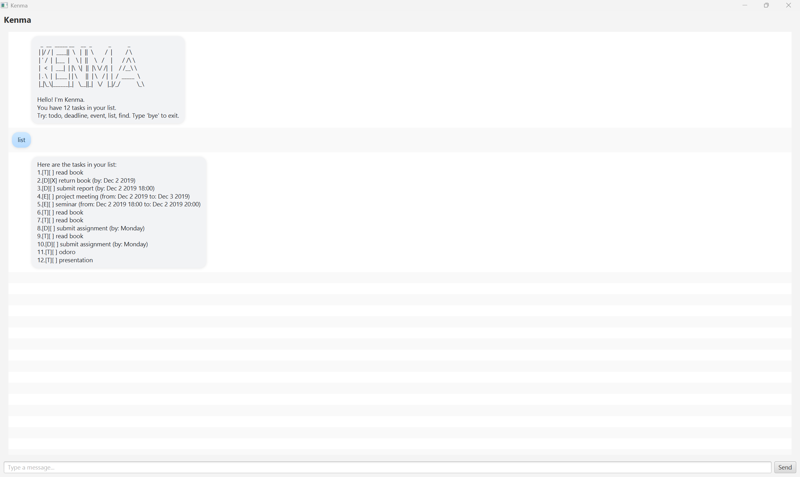

# Kenma — User Guide

Kenma is a lightweight, friendly task chatbot with a clean JavaFX GUI.  
You can add todos, deadlines, and events; search, sort, and mark them done—fast.

> **Screenshot**  
> The full app window (title bar with “Kenma”)
>
> 

---

## Quick Start

### Requirements
- **Java 17** or newer
- OS: Windows / macOS / Linux

### Run (from a cloned repo)
```bash
java -jar build/libs/kenma-win.jar
```


## How to Use

Kenma understands the commands below. **Extra spaces are OK** — Kenma normalizes whitespace.  
Dates accept `yyyy-MM-dd HHmm` or `yyyy-MM-dd` (interpreted as 00:00).

| Command   | Format                                           | Example                                                |
|-----------|--------------------------------------------------|--------------------------------------------------------|
| **todo**  | `todo <description>`                             | `todo read CS2103T notes`                              |
| **deadline** | `deadline <description> /by <date/time>`      | `deadline iP v1 /by 2025-10-01 2359`                  |
| **event** | `event <description> /from <start> /to <end>`    | `event demo /from 2025-10-02 1400 /to 2025-10-02 1600`|
| **list**  | `list`                                           | `list`                                                 |
| **find**  | `find <keyword>`                                 | `find demo`                                            |
| **on**    | `on <yyyy-MM-dd>`                                | `on 2025-10-01`                                        |
| **sort**  | `sort by name` \| `sort by status` \| `sort by time` | `sort by time`                                       |
| **mark**  | `mark <index>`                                   | `mark 2`                                               |
| **unmark**| `unmark <index>`                                 | `unmark 2`                                             |
| **delete**| `delete <index>`                                 | `delete 3`                                             |
| **bye**   | `bye`                                            | `bye`                                                  |

## Error Messages & Recovery

Kenma is designed to fail gracefully and guide you back on track. Errors appear in the chat as a **red bubble**.

- **Missing pieces** – e.g., no `/by` in a deadline → clear usage hint.
- **Duplicate flags** – e.g., two `/by` parts → asks you to keep only one.
- **Invalid dates** – wrong format or end ≤ start (for events) → explains the rule.
- **Bad index** – non-number or out of range → shows the valid range.
- **Duplicates** – adding the exact same task (same type/description/time) is blocked.
- **Storage** – missing `data/` is created automatically; corrupt lines are skipped; saves are atomic.

**Examples**
```text
deadline submit /by        -> Error: Missing '/by <date/time>'
event demo /from 2025-10-02 1600 /to 2025-10-02 1400 -> Error: end must be after start
mark abc                  -> Error: Please provide a valid integer index.
```

## Data File

- Location: `data/kenma.txt`
- Created automatically if missing (folder + file)
- Robust loading: skips corrupt lines instead of crashing
- Safe saving: writes to a temporary file and then replaces the original (atomic)
- Portable: back up or copy `data/kenma.txt` to migrate your tasks

## Tips

- Press **Enter** to send; the **Send** button works too.
- The window is resizable; messages auto-wrap to save space.
- `sort by time` brings upcoming items to the top.
- Use `find <keyword>` to filter a long list quickly.
- Dates accept `yyyy-MM-dd HHmm` or `yyyy-MM-dd` (00:00 assumed).

## About

- **Product name:** Kenma  
- **Platform:** Java 17, JavaFX  
- **Executable JAR:** `build/libs/kenma-win.jar`  
- **Data file:** `data/kenma.txt`

## Credits

- Chat bubble layout inspired by common JavaFX messenger UIs.
- See `AI.md` for notes on AI-assisted coding (tools used, where they helped).
